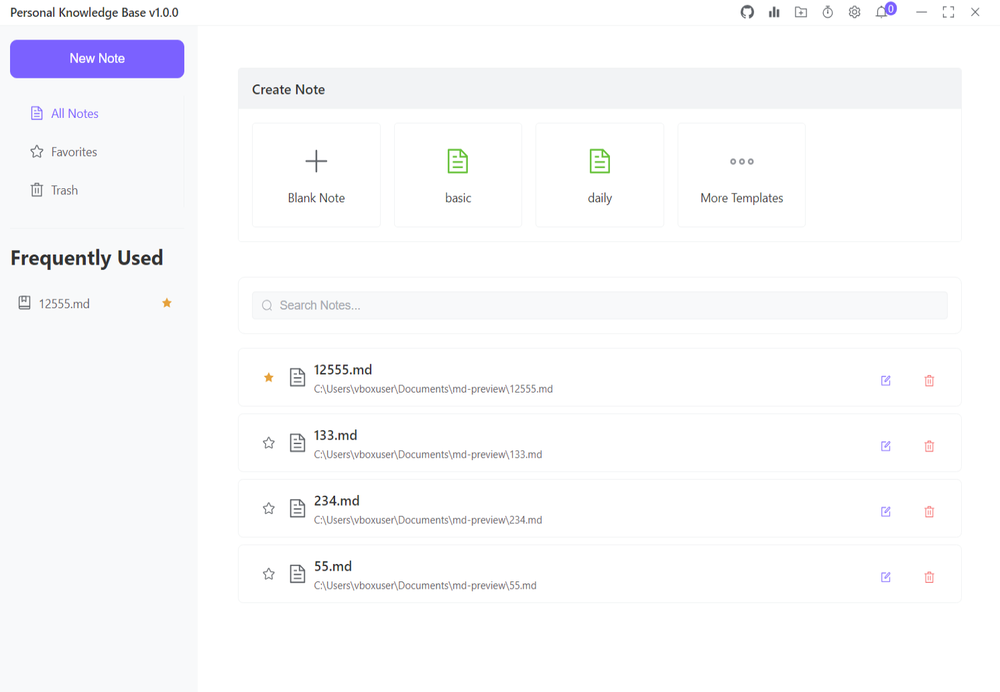

# ➤ Mine Knowledge MMA
<div align="center">
<p align="center">
  
</p>

<p align="center">

[](https://github.com/yeongpin/mine-knowledge-mma/releases/latest)
[](https://creativecommons.org/licenses/by-nc-nd/4.0/)
[](https://github.com/yeongpin/mine-knowledge-mma/stargazers)
[](https://github.com/yeongpin/mine-knowledge-mma/releases)

A modern and efficient personal knowledge management system built with Electron and Vue.js.

[Download](https://github.com/yeongpin/mine-knowledge-mma/releases) • [Features](#features)



</p>
</div>

## 🛠 Tech Stack

| Category | Technologies |
|----------|-------------|
| Framework |   |
| UI |   |
| State Management |  |
| Development |   |

## ✨ Features

| Feature | Description |
|---------|-------------|
| 📝 Markdown Support | Full markdown editing and preview with code highlighting |
| 🗂 File Management | Organize your knowledge with folders and files |
| 🔍 Quick Search | Fast and efficient search through all your notes |
| 📱 Multi-language | Support for English and Traditional Chinese |
| 🌙 Dark Mode | Built-in dark mode for comfortable night viewing |
| 🖼 Image Support | Drag & drop image upload with automatic optimization |
| ⭐ Favorites | Mark and quickly access your most important notes |
| 🗑 Trash System | Safely delete and restore notes when needed |
| 📋 Templates | Create notes from predefined templates |
| 📊 History Tracking | Track your recent note modifications |
| 🔄 Auto Save | Automatic saving of your work |
| 💾 Local Storage | All data stored locally for privacy |
| 🔄 Translation | Translate text between multiple languages |

## 🚀 Getting Started

### System Requirements

| Requirement | Version |
|------------|---------|
| Node.js | v16.0.0 or higher |
| npm/yarn | Latest stable version |
| Git | Latest stable version |

### 🛠️ Development Setup

##### Clone the repository
```bash
git clone https://github.com/yeongpin/mine-knowledge-mma.git
```

##### Navigate to the project directory
```bash
cd mine-knowledge-mma
```

##### Install dependencies
```bash
npm install
```

##### Start the development server
```bash
npm run dev
```

### 📦 Build Commands

##### Build for production
```bash
npm run build
```

## 📁 Project Structure

```plaintext
mine-knowledge-mma/
├── src/
│ ├── main/          # Main process files
│ ├── preload/       # Preload scripts
│ └── renderer/      # Frontend Vue.js files
│   ├── components/  # Vue components
│   ├── stores/      # Pinia stores
│   └── locales/     # i18n translations
├── public/          # Static assets
└── dist/           # Build output
```

## 🤝 Contributing

Contributions are welcome! Please read our [Contributing Guide](CONTRIBUTING.md) for details on our code of conduct and the process for submitting pull requests.

## 📄 License

This project is licensed under the Creative Commons Attribution-NonCommercial-NoDerivatives 4.0 International License - see the [LICENSE](LICENSE.md) file for details.

## 🙏 Acknowledgments

- [Electron](https://www.electronjs.org/) - For the amazing desktop framework
- [Vue.js](https://vuejs.org/) - For the progressive JavaScript framework
- [Element Plus](https://element-plus.org/) - For the beautiful UI components
- All our [contributors](https://github.com/yeongpin/mine-knowledge-mma/graphs/contributors)

---

<p align="center">
  Made with ❤️ by <a href="https://github.com/yeongpin">yeongpin</a>
  
</p>


